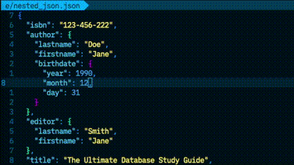
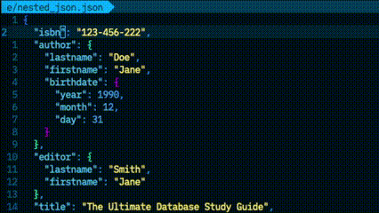
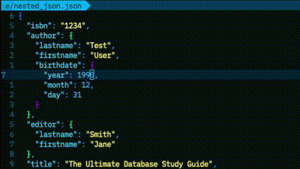
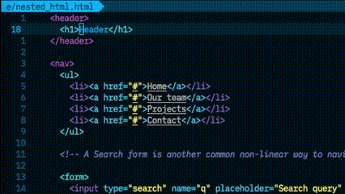
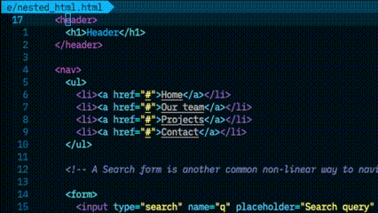
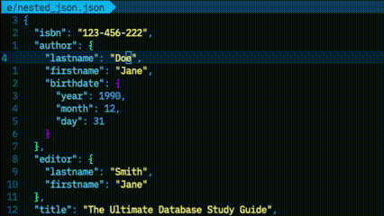
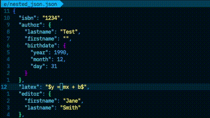

# InnerBlock

A neovim/vim plugin for manipulating user configurable blocks of text. Allows users to configure delimeters for blocks for one command actions (selection/change/delete).

## Purpose

* Quickly select/edit/delete text inside delimiters (blocks)
    * Properly handle nested delimeters
* Allow customization of blocks
    * Handle blocks with special regex characters


## Installation

### Vimscript (vim-plug)

```vim
" vim-plug
Plug 'simmsa/innerblock'
```

### Lua (lazy.vim)

```lua
require("lazy").setup({
    'simmsa/innerblock'
})
```

## Usage

In normal mode the following commands are available:

* Bracket blocks (`()`  `[]`, `{}`)
    * `cib`: Change inside brackets
    * `dib`: Delete inside brackets
    * `sib`: Sort inside brackets
* HTML tag blocks (`<>`, `><`)
    * `cit`: Change inside tag
    * `dit`: Delete inside tag
* String blocks (`""`, `''`, \`\`)
    * `cis`: Change inside string
    * `dis`: Delete inside string
* $\LaTeX$ blocks (`$$`)
    * `cil`: Change inside latex block
    * `dil`: Delete inside latex block

## Examples

### Brackets








### Tags





### Strings



### $\LaTeX$




## Default Settings

### Vimscript

#### Block Setup

Define delimiters for blocks of text/code

```vim
" Inside Brackets
let g:inner_block_bracket_pairs = [
    \ ['(', ')'],
    \ ['{', '}'],
    \ ['[', ']'],
\]

let g:inner_block_html_tag_pairs = [
    \ ["<", ">"],
    \ ['<', '/>\|>'],
    \ ['>', '<'],
\]

let g:inner_block_string_pairs = [
    \ ["'", "'"],
    \ ['"', '"'],
    \ ['`', '`'],
\]

let g:inner_block_latex_pairs = [
    \ ['\$', '\$'],
\]
```

#### Depth Configuration

Define the size/depth of bracket searches

```vim

" Search this many lines above and below the current window
let g:inner_block_limit = 50
" Search this many levels of nesting
let g:inner_block_max_level = 16

```

#### Mappings

Map bracket pairs to InnerBlock functions

```vim

" Inside Brackets
nnoremap <silent> cib :call innerblock#DeleteInnerBlock(g:inner_block_bracket_pairs, "different", "c")<CR>
nnoremap <silent> dib :call innerblock#DeleteInnerBlock(g:inner_block_bracket_pairs, "different", "k")<CR>
nnoremap <silent> sib :call innerblock#SortInsideBlock(g:inner_block_bracket_pairs)<CR>

" Inside Tags
nnoremap <silent> cit :call innerblock#DeleteInnerBlock(g:inner_block_html_tag_pairs, "different", "c")<CR>
nnoremap <silent> dit :call innerblock#DeleteInnerBlock(g:inner_block_html_tag_pairs, "different", "k")<CR>
nnoremap <silent> sit :call innerblock#SortInsideBlock(g:inner_block_html_tag_pairs)<CR>

" Inside String
nnoremap <silent> cis :call innerblock#DeleteInnerBlock(g:inner_block_string_pairs, "different", "c")<CR>
nnoremap <silent> dis :call innerblock#DeleteInnerBlock(g:inner_block_string_pairs, "different", "k")<CR>

" Inside Latex
nnoremap <silent> cil :call innerblock#DeleteInnerBlock(g:inner_block_latex_pairs,  "same", "c")<CR>
nnoremap <silent> dil :call innerblock#DeleteInnerBlock(g:inner_block_latex_pairs, "same", "k")<CR>
```

